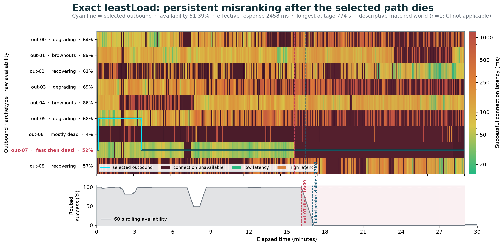

# Xray routing through unreliable outbounds

This repository numerically evaluates Xray balancer strategies against realistic, time-correlated outbound failures. It generates pools of 5–20 synthetic outbounds, routes one connection attempt per second for 30 minutes, and compares availability, response time, outage length, and route churn over matched Monte Carlo worlds.

- [Open the interactive Route Lab](https://eliotcougar.github.io/xray-routing-through-unreliable-outbounds/)
- [Read the whitepaper (PDF)](https://eliotcougar.github.io/xray-routing-through-unreliable-outbounds/xray-unreliable-routing.pdf)

The current reference dataset contains 400 independent worlds: 50 for each of eight scenarios. All 31 strategy presets run against every world, producing 12,400 matched strategy-world results and 22.32 million one-second route decisions. The scenarios cover mostly healthy fleets, latency ladders, fast-but-flaky paths, shared-provider incidents, congestion waves, rolling degradation, hostile networks, and a broad mixed fleet.

## Repository contents

- `xray_strategy_sim/` — simulation model, observatories, selector implementations, experiment runner, and command-line interface.
- `data/monte-carlo/` — the latest 400-world dataset, metadata, report, representative traces, and generated dataset figures.
- `docs/xray-unreliable-routing.pdf` and `.docx` — the finished whitepaper.
- `docs/figures/` — figures embedded in the whitepaper.
- `docs/xray-algorithm-mapping.md` — mapping from the Python implementations to pinned Xray-core and v2rayNG sources.
- `site/` — the dependency-free interface plus a Web Worker that runs the Python simulator through Pyodide.
- `scripts/build_pages.py` — assembles the static GitHub Pages artifact.
- `tests/` — deterministic unit and integration tests.

The whitepaper and its figures are published artifacts. Their internal authoring tools are intentionally not part of this end-user repository.

## Run the Monte Carlo simulation

Requirements:

- Python 3.11 or newer
- Enough free disk space for the requested traces and figures
- Multiple CPU cores are helpful for full runs

Windows PowerShell setup:

```powershell
python -m venv .venv
.venv\Scripts\python -m pip install -r requirements.txt
```

macOS or Linux setup:

```bash
python3 -m venv .venv
.venv/bin/python -m pip install -r requirements.txt
```

A quick smoke run:

```powershell
.venv\Scripts\python -m xray_strategy_sim --trials 24 --minutes 5 --workers 4 --output outputs\smoke
```

Reproduce the current matrix in a separate output directory:

```powershell
.venv\Scripts\python -m xray_strategy_sim `
  --trials 400 --minutes 30 --workers 8 `
  --output outputs\reproduction
```

On macOS or Linux, use `.venv/bin/python` and backslash line continuations. `--trials` is the total world count; scenarios are assigned round-robin, so 400 trials yield 50 worlds per scenario. Omit `--workers` or set it to `0` to use the detected logical CPU count. Seeds, scenario assignment, row order, and results are deterministic across worker counts.

Useful discovery commands:

```powershell
.venv\Scripts\python -m xray_strategy_sim --list-scenarios
.venv\Scripts\python -m xray_strategy_sim --list-strategies
```

Use repeated `--scenario` or `--strategy` flags for a focused matrix. Run `python -m xray_strategy_sim --help` for all controls, including duration, outbound-count range, attempt interval, seed, and failure penalty.

Every result directory includes:

- `metadata.json` — exact configuration, seeds, scenario counts, assumptions, source commits, and strategy settings.
- `trial_metrics.csv` — one row per world and strategy, suitable for paired comparisons.
- `summary.csv` — aggregate and per-scenario statistics with 95% confidence intervals and absolute worst outage.
- `representative_outbounds.csv` and `representative_strategies.csv` — full one-second example traces.
- `report.md` and `figures/` — a compact generated analysis of that run.

`effective_mean_ms` combines responsiveness and availability by charging the configured timeout penalty to failed attempts. Successful-only latency and raw availability are also reported separately.

## Interactive Route Lab

The published Route Lab is static: simulation runs locally in a browser Web Worker through a same-origin, self-hosted Pyodide runtime, while the Monte Carlo comparison table is loaded from the tracked dataset. No simulated or real network traffic is sent to Xray outbounds.

To preview the exact Pages artifact locally:

```powershell
.venv\Scripts\python scripts\build_pages.py
.venv\Scripts\python -m http.server 8765 --directory build\pages
```

Then open `http://127.0.0.1:8765/`. The first interactive run downloads the browser Python runtime; subsequent runs reuse it for that page session.

## Tests

```powershell
.venv\Scripts\python -m unittest discover -s tests -v
```

The simulator translations are grounded in the pinned upstream code documented in [the algorithm mapping](docs/xray-algorithm-mapping.md). Experimental selectors are clearly separated from exact Xray behavior in both the metadata and whitepaper.
